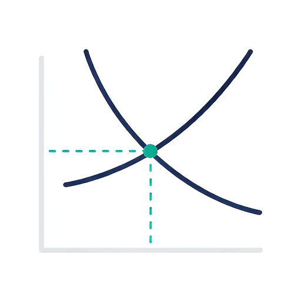

> 🌐 语言：[中文](README.zh-CN.md) · [English](README.md)

<div align="center">



# econ-modeling-flash

**从真实世界的现象，到可以站得住脚的经济学模型——只需 9 步引导。**

*一个新手友好、达到科研水准的小型经济学建模工具包。*
*它自带一整套严谨护甲：七道质量闸、强制性的交付前审计，以及一次模拟专家评审。*


</div>

---

## 这是什么

`econ-modeling-flash` 是一个智能体**技能（skill）**，带你从

> *"我在现实里注意到一件有点反常的事……"*

走到

> *"……而这是关于它的一套小巧、内部自洽、可检验的经济学模型。"*

—— 如果需要，还能产出一篇编译好的 LaTeX 工作论文。

它刻意**小而诚实**。它不追求顶刊级别的创新，也不会把一个玩具模型包装成重大突破。它真正保证的，是一篇真实理论章节该有的纪律：**明确的假设 → 完整的逻辑链 → 可验证的命题 → 一句关于现实世界的清晰结论。**

> **贯穿每一步的三条承诺**
> 1. **科学严谨** —— 你的读者是懂经济学的人。绝不降维简化，也绝不容许误导。
> 2. **以简为美** —— 漂亮的模型假设*少*、形式*简单*。长长的参数表不是高深，是累赘。
> 3. **实用导向** —— 模型必须回答一个真实问题，并给出一个可以引用、可以行动的洞见。它服务于研究，而非娱乐。

---

## 适合谁用

- 🎓 **学生**（经济学 / 管理学），要写第一篇理论章节、毕业论文的一章，或研讨课论文
- 🔬 **研究者**，想在投入数周之前，用一套快速而有纪律的脚手架先检验一下自己的直觉
- 🧠 **任何**曾问过*"经济学能解释这个吗？"*、却不知从何下手的人

你**不需要**是理论高手。你只需要保有好奇心——并愿意让质量闸对你说"不"。

---

## 它有何不同

多数"AI，给我建个模型"的流程，丢给你一堆方程就结束了。这个流程丢给你方程，**然后反过来攻击这些方程**——*在*把它们当作答案呈现*之前*。

| | 普通流程 | **econ-modeling-flash** |
|---|---|---|
| 假设 | 隐含在散文里 | **显式、编号、每条都有依据 + 可检验性标签** |
| 方程 | "看着差不多对" | **每条方程都有依据 + 独立重推导 + 数值回代校验（误差 < 1e-9）** |
| 论断 | 自信地陈述 | **认知标签：解析结果 · 数值示意 · 机制示意图** |
| 文献 | 看着像那么回事 | **仅接受线上核证过的 `[已核证]`，杜绝伪造引用** |
| 交付 | "搞定！" | **7 道闸 + 强制审计（0 FAIL）后方可称"完成"** |
| 修订 | 静默进行 | **S8.1 重新评审：每次改动都重新打分，并报告前后差异** |

---

## 快速上手

**1 · 安装 / 启用技能** —— 把 `econ-modeling-flash/` 文件夹放进你智能体的技能目录即可。

**2 · 给引擎做个冒烟测试** *(可选，约 1 秒)*

```bash
python scripts/selftest.py     # 预期输出：  Cases: 55 | passed: 55 | failed: 0
```

**3 · 描述一个现象就行。** 例如：

> *"互联网使用能提供劳动者的收入。经济学能解释为什么吗？"*

**4 · 回答两个问题** —— *经典还是新颖*的解释，以及*属于哪个领域*（教育、劳动、产业组织……）。之后技能会**一步步**推进，把每一步都写入磁盘。

这就是全部的入门流程。无需配置、无需调参、无需任何建模经验。

---

## 九步流程 —— 本技能的核心特色

每个项目都跑同一条主干。每一步都有**目的、脚本化的交互、行动清单与自检项**；没有任何一步是即兴发挥。

| 步 | 名称 | 发生什么 | 产出 |
|:---:|---|---|---|
| **S1** | 描述现象 | 线上核实、给证据分级、梳理相关方、列出候选理论 | `S1_phenomenon.md` |
| **S2** | 确定视角 | *你来选择：* 经典 vs 新颖解释 + 学科领域 | `S2_perspective.md` |
| **S3** | 核心假设 | 将前提规范化、提议补充项、锁定一套主导理论 | `S3_assumptions.md` |
| **S4** | 建模与求解 | 符号表 → 优化 → 均衡 → **符号求解 + 数值校验** | `S4_model.md` + `.py` |
| **S5** | 校验 | 五道硬校验：符号 · 一致性 · 求解 · 边界 · 量纲 **+ 交付前审计** | `S5_checks.md` |
| **S6** | 撰写报告 | 假设、参数、命题、结果、**经济学解释** | `S6_model_report.md` |
| **S7** | 拓展 | 比较静态 · 敏感性扫描 · **放宽 ≥ 1 个假设** · 异质性 | `S7_extension.md` + `figs/` |
| **S8** | 专家评审 | 5 位评审独立打分 → 交叉质询 → 汇总 + 分歧诊断 | `S8_review.md` |
| **S8.1** | **修订后重新评审** *(条件触发但强制)* | S8 之后又改了模型？旧结论已失效——重新打分并报告差异 | `S8.1_review_after_revision.md` |
| **S9** | 成文 | 整合成短论文，并**编译 LaTeX → PDF** | `S9_paper.tex` + `.pdf` |

```
 现  象
        │
        ▼
 [S1]────────[S2]────────[S3]────────[S4]────────[S5]────────[S6]────────[S7]
 描述现象    确定视角     核心假设     建模/求解     校验 ✅      写报告      拓展
        │                                                            │
        │                                                            ▼
        │                                                     [S8] 专家评审
        │                                                            │
        │                                      改了模型？ ───┤
        │                                                            ▼
        │                                                  [S8.1] 重新评审
        │                                                            │
        └───────────────────────────────────────────────────────────►▼
                                                          [S9] LaTeX 论文 → PDF
```

> **S8.1 一句话总结：** *修订不是升级。* 修掉一个缺陷只是移除了一个问题——并不代表模型比原本更好。S8.1 会针对**每一个**维度报告修订前后的得分，让你精确看到什么变了、什么没变。

---

## 严谨护甲 —— 输出质量如何被保护

这正是本技能的价值所在。任何交付物在被称作"完成"之前，都必须通过以下关卡。

### 七道质量闸

| 闸 | 它要问的问题 | 通不过时 |
|:---:|---|---|
| **G1 · 框架** | 现象是否核实？用户是否确认了视角？ | 回到 S1/S2 去问 |
| **G2 · 假设** | 假设是否显式、可辩护、彼此一致、且有依据？ | 回到 S3 |
| **G3 · 求解** | 是否回代了一阶条件？是否检查了二阶条件？闭式解是否经数值验证？ | 修正，或降级并披露 |
| **G4 · 一致性** | 一个符号 = 一个含义？参数与变量边界清晰？量纲一致？ | 回到 S5 |
| **G5 · 证据** | 每条文献是否都 `[已核证]`？数值结果是否被正确标注？ | 核证或删除 |
| **G6 · 措辞** | 有没有"我们证明了"用来形容一个数值、"普遍"用来形容一个网格、"稳健"用来形容一个点？ | 重写措辞 |
| **G7 · 审计** | `audit_model.py` 是否返回 **0 FAIL**？S8 之后的修订是否重新评审过？ | 跑审计 + 自检；**不得定稿** |

### 不可妥协的全局规则

- **禁止伪造引用。** 每条文献都在本次会话中线上核证；无法核实的一律挡在论文之外。
- **每个方程都有依据** —— 文献、教科书、制度事实，或一条显式标注"为简便"的假设。
- **诚实的认知标签。** 解析结果 ≠ 数值示意 ≠ 机制示意图。绝不混淆。
- **能降级，不造假。** 若没有闭式解，技能会*如实说明*，并以数值示意替代，而不是编造一个证明。
- **每次改动都审计。** 任何编辑之后，都会重跑审计与自检。未经重新审计的修订，绝不称作"完成"。
- **模拟评审会被明确标注为模拟。** 它诚实地衡量模型自身的质量——它永远不会变成"这通过了同行评审"。

### 护甲背后的工具

| 工具 | 职责 |
|---|---|
| `scripts/econ_solve.py` | 符号求解 · 比较静态 · 符号扫描(lint) · 敏感性扫描与绘图 |
| `scripts/review_score.py` | S8/S8.1 的打分汇总、分档、Fleiss-κ 分歧诊断 |
| `scripts/audit_model.py` | **交付前审计（G7 闸）：** 符号表完整性、参数一致性、修订后的数值回归、交付物卫生、论断安全性 |
| `scripts/selftest.py` | **55 条回归用例**，守护解析器/求解器/评审器/审计器——*首次使用前与任何改动后都要运行* |

### 以及一条你能审计的痕迹链

每个数字都可复现、可追溯：

- ✅ **可复现** —— 求解器规格（`spec_*.json`）+ 每次运行的 `logs/run.log`
- ✅ **可追溯** —— `S9_references_check.md` 逐条记录每条文献的核证来源（或排除理由）
- ✅ **自我批判** —— `S8_review.md` 以一份**"你绝不能宣称的内容"**清单收尾，让你绝不过度吹嘘
- ✅ **回归检查** —— 修订之后，技能会在旧文件里检索残留的过时数字与未更新的结论

---

## 你会得到什么

一个完整、自洽的项目目录：

```
econ_model_<slug>/
├── state.json                     # 当前步骤、决策、断点续跑位置
├── S1_phenomenon.md               # ……一直到……
├── S9_paper.tex / S9_paper.pdf    # 短论文（若环境具备 LaTeX）
├── S9_references_check.md         # 逐条文献核证台账
├── figs/                          # 全部图表（PNG + PDF）
└── logs/run.log                   # 可复现的运行日志
```

**随时可续跑：** 说一句*"继续"*，技能会读取 `state.json`，找到下一步，并重新检查上一步产出是否完整。

---

## 推荐书单 —— 经济学，从零到能建模

刚接触经济学，或想建出真正令人信服的模型？以下是本技能所依凭的书籍，按阅读顺序排列。

### 🌱 从这里起步 —— 大白话，无需数学

| 书名 | 作者 | 为什么读 |
|---|---|---|
| **《裸体经济学》(Naked Economics)** | Charles Wheelan | 把"经济学家到底怎么想"讲得最清楚的一本。如果只读一本，就读它。 |
| **《卧底经济学》(The Undercover Economist)** | Tim Harford | 把日常谜题（咖啡定价、超市排队）变成经济学。特别擅长帮你发现值得建模的现象。 |
| **《魔鬼经济学》(Freakonomics)** | Levitt & Dubner | 激励如何重塑行为。有趣——更是一堂"如何找到值得形式化的问题"的大师课。 |

### 📐 工具箱 —— 如何真正建一个模型

| 书名 | 作者 | 为什么读 |
|---|---|---|
| **《中级微观经济学：现代观点》(Intermediate Microeconomics: A Modern Approach)** | Hal R. Varian | **与本技能最配的单本伴侣书。** 效用、需求、均衡、比较静态——均配例题。 |
| **《应用经济学家的博弈论》(Game Theory for Applied Economists)** | Robert Gibbons | 短小、应用导向，足以建模策略性情境（议价、进入、信号传递）。 |
| **《微观经济理论教程》(A Course in Microeconomic Theory)** | David M. Kreps | 进阶一阶：当你想比基础更深时的严谨微观理论。 |

### 🔍 更进一步 —— 行为、证据与前沿

| 书名 | 作者 | 为什么读 |
|---|---|---|
| **《思考，快与慢》(Thinking, Fast and Slow)** | Daniel Kahneman | 标准偏好假设在哪里崩塌——这是"新颖"模型机制的灵感来源。 |
| **《贫穷的本质》(Poor Economics)** | Banerjee & Duflo | 好问题如何遇上真实数据。一本"如何思考政策效应"的范本。 |
| **《基本无害的计量经济学》(Mostly Harmless Econometrics)** | Angrist & Pischke | 对应实证的一半：如何判断一个效应是否真实（与 `causal-infer-master` 技能搭配使用）。 |

---

## 边界 —— 它能做与不会做的

**它会的：** 建一个小型、内部自洽、可辩护、可检验的理论模型——并诚实地告诉你它能、且不能宣称什么。

**它不会的：**

- ✋ **追逐顶刊原创性。** 它瞄准的是*及格*，不是*卓越*。
- ✋ **跑你的回归。** 不做微观数据、不做估计。
- ✋ **替你读文献。** 它提供线索与必读清单；论证本身仍需你回到原始论文。
- ✋ **安装软件。** 只使用已经存在的 Python 环境。
- ✋ **把自评变成同行评审。** S8/S8.1 评审是*模拟的*——结构化、诚实，并明确标注为模拟。

---

<div align="center">

**用得顺手？** 给仓库点个 Star ⭐——如果某道闸帮你避开了一个尴尬的错误，那正是本技能的用意所在。

*为想要自己第一个模型就诚实的人而造。*

</div>
